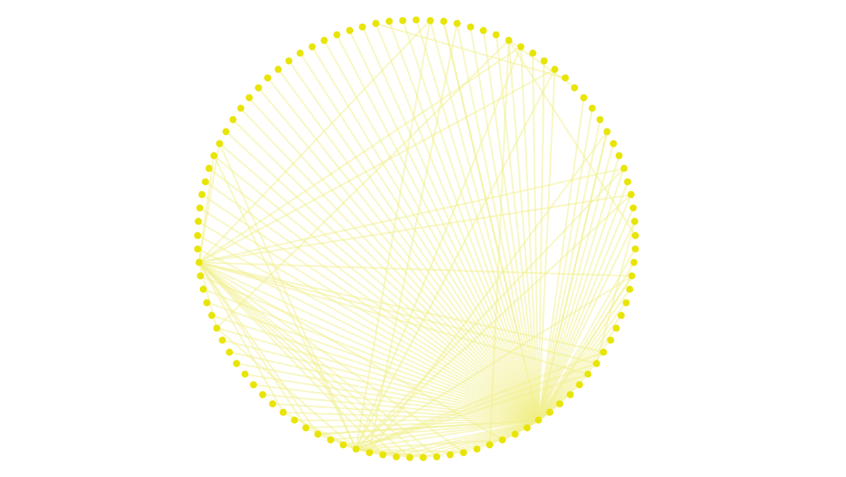

Circle Layout
=============

This graph is a demo representing the circular layout present on GraphSpace.
You can construct this graph in **graphspace_python** by the following steps:

Importing necessary modules
^^^^^^^^^^^^^^^^^^^^^^^^^^^

You have to import the :class:`~graphspace_python.graphs.classes.gsgraph.GSGraph`
class to construct a graph, :class:`~graphspace_python.api.client.GraphSpace` client
class to upload the graph to GraphSpace, and other necessary modules (urllib and json).

>>> import urllib
>>> import json
>>> from graphspace_python.graphs.classes.gsgraph import GSGraph
>>> from graphspace_python.api.client import GraphSpace

Initialize GraphSpace client
^^^^^^^^^^^^^^^^^^^^^^^^^^^^

You have to initialize the GraphSpace client by providing your username and password.

>>> graphspace = GraphSpace('user1@example.com', 'user1')

Fetch graph data
^^^^^^^^^^^^^^^^

You can fetch the structural data of the Circle Layout graph, consisting of its nodes
and edges, present in the `Cytoscape.js repository <https://github.com/cytoscape/
cytoscape.js/blob/master/documentation/demos/circle-layout/data.json>`_, by using
urllib and json module.

>>> data_url = 'https://raw.githubusercontent.com/cytoscape/cytoscape.js/master/documentation/demos/circle-layout/data.json'
>>> response = urllib.urlopen(data_url)
>>> graph_data = json.loads(response.read())

Initialize graph
^^^^^^^^^^^^^^^^

You can create a graph using the GSGraph class.

>>> G = GSGraph()

Set name,tags and visibility status
^^^^^^^^^^^^^^^^^^^^^^^^^^^^^^^^^^^

Using the mothods of the GSGraph class you can set name, tags and visibility status
for your newly created graph.

>>> G.set_name('Circle Layout')
>>> G.set_tags(['circle-layout', 'graphspace', 'demo'])
>>> G.set_is_public()

Define meta-data
^^^^^^^^^^^^^^^^

Meta data for the graph can be set in the following way:

>>> data = {
>>>     'description': 'This is a demo graph having circular layout. You can also view this demo graph at:\
>>>  <a href=\"http://js.cytoscape.org/demos/circle-layout/\">http://js.cytoscape.org/demos/circle-layout/</a>',
>>>     'directed': True
>>> }
>>> G.set_data(data)

Construct nodes and edges of graph from graph data
^^^^^^^^^^^^^^^^^^^^^^^^^^^^^^^^^^^^^^^^^^^^^^^^^^

The fetched graph data is an array of elements where each element is either a node
or edge. To properly construct the graph from the data, add nodes and edges to the
graph by checking whether the element is a node or edge.

>>> for elem in graph_data:
>>>     if elem['group'] == 'nodes':
>>>         G.add_node(elem['data']['id'], elem['data'])
>>>         G.set_node_position(elem['data']['id'], elem['position']['y'], elem['position']['x'])
>>>     else:
>>>         G.add_edge(elem['data']['source'], elem['data']['target'], elem['data'])

Set styling for graph elements
^^^^^^^^^^^^^^^^^^^^^^^^^^^^^^

You can define style for the nodes and edges of the graph in the following manner:

>>> G.add_style('node', {
>>>     'height': 20,
>>>     'width': 20,
>>>     'background-color': '#e8e406'
>>> })
>>> G.add_style('edge', {
>>>     'curve-style': 'haystack',
>>>     'haystack-radius': 0,
>>>     'width': 5,
>>>     'opacity': 0.5,
>>>     'line-color': '#f2f08c'
>>> })

Upload graph to GraphSpace
^^^^^^^^^^^^^^^^^^^^^^^^^^

Finally, you can upload the graph to GraphSpace.

>>> graph = graphspace.post_graph(G)
>>> graph.url
'http://graphspace.org/graphs/32708'

After you upload the graph you can open it on GraphSpace and change the layout to
**Circle** for correct visualization of the graph. You can then save it as a new
layout for the graph.

This demo graph is already present on GraphSpace. You can view it at
`http://graphspace.org/graphs/22725 <http://graphspace.org/graphs/22725>`_

