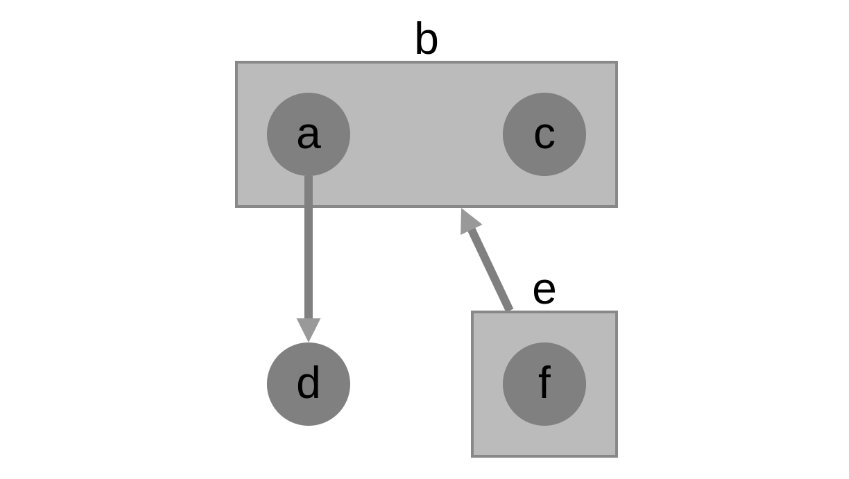

Compound Nodes
==============

This graph is a demo showing the implementation of compound nodes in GraphSpace.
You can construct this graph in **graphspace_python** by the following steps:

Importing necessary modules
^^^^^^^^^^^^^^^^^^^^^^^^^^^

You have to import the :class:`~graphspace_python.graphs.classes.gsgraph.GSGraph`
class to construct a graph and :class:`~graphspace_python.api.client.GraphSpace` client
class to upload the graph to GraphSpace.

>>> from graphspace_python.graphs.classes.gsgraph import GSGraph
>>> from graphspace_python.api.client import GraphSpace

Initialize GraphSpace client
^^^^^^^^^^^^^^^^^^^^^^^^^^^^

You have to initialize the GraphSpace client by providing your username and password.

>>> graphspace = GraphSpace('user1@example.com', 'user1')

Initialize graph
^^^^^^^^^^^^^^^^

You can create a graph using the GSGraph class.

>>> G = GSGraph()

Set name,tags and visibility status
^^^^^^^^^^^^^^^^^^^^^^^^^^^^^^^^^^^

Using the mothods of the GSGraph class you can set name, tags and visibility status
for your newly created graph.

>>> G.set_name('Compound Nodes')
>>> G.set_tags(['compound-nodes', 'graphspace', 'demo'])
>>> G.set_is_public()

Define meta-data
^^^^^^^^^^^^^^^^

Meta data for the graph can be set in the following way:

>>> data = {
>>>     'description': 'This is a demo graph having compund nodes. You can also view this demo graph at:\
>>>  <a href=\"http://js.cytoscape.org/demos/compound-nodes/\">http://js.cytoscape.org/demos/compound-nodes/</a>',
>>>     'directed': True
>>> }
>>> G.set_data(data)

Adding nodes to the graph
^^^^^^^^^^^^^^^^^^^^^^^^^

You can add nodes to the graph using the :meth:`~graphspace_python.graphs.classes.gsgraph.GSGraph.add_node`
method available in the GSGraph class.

>>> G.add_node('a', parent='b')
>>> G.add_node('b')
>>> G.add_node('c', parent='b')
>>> G.add_node('d')
>>> G.add_node('e')
>>> G.add_node('f', parent='e')

Set node positions
^^^^^^^^^^^^^^^^^^

After adding the nodes you can set their positions(x,y coord) in the following way:

>>> G.set_node_position('a', x=215, y=85)
>>> G.set_node_position('c', x=300, y=85)
>>> G.set_node_position('d', x=215, y=175)
>>> G.set_node_position('f', x=300, y=175)

Adding edges to the graph
^^^^^^^^^^^^^^^^^^^^^^^^^

You can add edges to the graph using the :meth:`~graphspace_python.graphs.classes.gsgraph.GSGraph.add_edge`
method available in the GSGraph class.

>>> G.add_edge('a', 'd')
>>> G.add_edge('e', 'b')

Set styling for the graph elements
^^^^^^^^^^^^^^^^^^^^^^^^^^^^^^^^^^

You can assign style to the added nodes and edges in the following manner:

>>> G.add_style('node', {
>>>     "content": "data(id)",
>>>     "text-valign": "center",
>>>     "text-halign": "center",
>>>     "background-color": "grey"
>>> })
>>> G.add_style('$node > node', {
>>>     "padding-top": "10px",
>>>     "padding-left": "10px",
>>>     "padding-bottom": "10px",
>>>     "padding-right": "10px",
>>>     "text-valign": "top",
>>>     "text-halign": "center",
>>>     "background-color": "#bbb"
>>> })
>>> G.add_style('edge', {
>>>     "target-arrow-shape": "triangle",
>>>     "line-color": "grey"
>>> })

Upload graph to GraphSpace
^^^^^^^^^^^^^^^^^^^^^^^^^^

Finally, you can upload the graph to GraphSpace.

>>> graph = graphspace.post_graph(G)
>>> graph.url
'http://graphspace.org/graphs/32708'

This demo graph is already present on GraphSpace. You can view it at
`http://graphspace.org/graphs/22776 <http://graphspace.org/graphs/22776>`_

