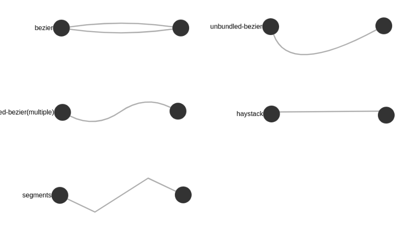

Edge Types
==========

This graph showcases the different types of edges supported by GraphSpace.
You can construct this graph in **graphspace_python** by the following steps:

Importing necessary modules
^^^^^^^^^^^^^^^^^^^^^^^^^^^

You have to import the :class:`~graphspace_python.graphs.classes.gsgraph.GSGraph`
class to construct a graph and :class:`~graphspace_python.api.client.GraphSpace` client
class to upload the graph to GraphSpace.

>>> from graphspace_python.graphs.classes.gsgraph import GSGraph
>>> from graphspace_python.api.client import GraphSpace

Initialize GraphSpace client
^^^^^^^^^^^^^^^^^^^^^^^^^^^^

You have to initialize the GraphSpace client by providing your username and password.

>>> graphspace = GraphSpace('user1@example.com', 'user1')

Initialize graph
^^^^^^^^^^^^^^^^

You can create a graph using the GSGraph class.

>>> G = GSGraph()

Set name,tags and visibility status
^^^^^^^^^^^^^^^^^^^^^^^^^^^^^^^^^^^

Using the mothods of the GSGraph class you can set name, tags and visibility status
for your newly created graph.

>>> G.set_name('Edge Types Demo')
>>> G.set_tags(['edge-types', 'graphspace', 'demo'])
>>> G.set_is_public()

Define meta-data
^^^^^^^^^^^^^^^^

Meta data for the graph can be set in the following way:

>>> data = {
>>>     'description': 'This is a demo graph showing different types of edges. You can also view this demo graph at:\
>>>  <a href=\"http://js.cytoscape.org/demos/edge-types/\">http://js.cytoscape.org/demos/edge-types/</a>',
>>>     'directed': False
>>> }
>>> G.set_data(data)

Adding nodes to the graph
^^^^^^^^^^^^^^^^^^^^^^^^^

You can add nodes to the graph using the :meth:`~graphspace_python.graphs.classes.gsgraph.GSGraph.add_node`
method available in the GSGraph class.

>>> G.add_node('n01', label='bezier')
>>> G.add_node('n02')
>>> G.add_node('n03', label='unbundled-bezier')
>>> G.add_node('n04')
>>> G.add_node('n05', label='unbundled-bezier(multiple)')
>>> G.add_node('n06')
>>> G.add_node('n07', label='haystack')
>>> G.add_node('n08')
>>> G.add_node('n09', label='segments')
>>> G.add_node('n10')

Set node positions
^^^^^^^^^^^^^^^^^^

After adding the nodes you can set their positions(x,y coord) in the following way:

>>> G.set_node_position('n01', y=142.4, x=108.1)
>>> G.set_node_position('n02', y=142.4, x=391.8)
>>> G.set_node_position('n03', y=142.2, x=670.1)
>>> G.set_node_position('n04', y=146.6, x=966.1)
>>> G.set_node_position('n05', y=342.9, x=110.7)
>>> G.set_node_position('n06', y=340.2, x=385.2)
>>> G.set_node_position('n07', y=343.3, x=666.2)
>>> G.set_node_position('n08', y=344.9, x=969.5)
>>> G.set_node_position('n09', y=540.4, x=104.4)
>>> G.set_node_position('n10', y=539.2, x=397.6)

Adding edges to the graph
^^^^^^^^^^^^^^^^^^^^^^^^^

You can add edges to the graph using the :meth:`~graphspace_python.graphs.classes.gsgraph.GSGraph.add_edge`
method available in the GSGraph class.

>>> G.add_edge('n09', 'n10', {'type': 'segments'})
>>> G.add_edge('n08', 'n07', {'type': 'haystack'})
>>> G.add_edge('n05', 'n06', {'type': 'multi-unbundled-bezier'})
>>> G.add_edge('n01', 'n02', {'type': 'bezier'})
>>> G.add_edge('n03', 'n04', {'type': 'unbundled-bezier'})
>>> G.add_edge('n02', 'n01', {'type': 'bezier'})

Set styling for the graph elements
^^^^^^^^^^^^^^^^^^^^^^^^^^^^^^^^^^

You can assign style to the added nodes and edges in the following manner:

>>> G.add_style('node', {
>>>     "height": 40,
>>>     "width": 40,
>>>     "background-color": "#333",
>>>     "text-valign": "center",
>>>     "text-halign": "left"
>>> })
>>> G.add_style('edge', {
>>>     "width": 3,
>>>     "opacity": 0.666,
>>>     "line-color": "#888"
>>> })
>>> G.add_style('edge[type="bezier"]', {
>>>     "curve-style": "bezier",
>>>     "control-point-step-size": 40
>>> })
>>> G.add_style('edge[type="unbundled-bezier"]', {
>>>     "curve-style": "unbundled-bezier",
>>>     "control-point-distances": 120,
>>>     "control-point-weights": 0.1
>>> })
>>> G.add_style('edge[type="multi-unbundled-bezier"]', {
>>>     "curve-style": "unbundled-bezier",
>>>     "control-point-distances": [40, -40],
>>>     "control-point-weights": [0.250, 0.75]
>>> })
>>> G.add_style('edge[type="haystack"]', {
>>>     "curve-style": "haystack",
>>>     "haystack-radius": 0.5
>>> })
>>> G.add_style('edge[type="segments"]', {
>>>     "curve-style": "segments",
>>>     "segment-distances": [ 40, -40 ],
>>>     "segment-weights": [0.250 , 0.75]
>>> })

Upload graph to GraphSpace
^^^^^^^^^^^^^^^^^^^^^^^^^^

Finally, you can upload the graph to GraphSpace.

>>> graph = graphspace.post_graph(G)
>>> graph.url
'http://graphspace.org/graphs/32708'

This demo graph is already present on GraphSpace. You can view it at
`http://graphspace.org/graphs/22771 <http://graphspace.org/graphs/22771>`_

