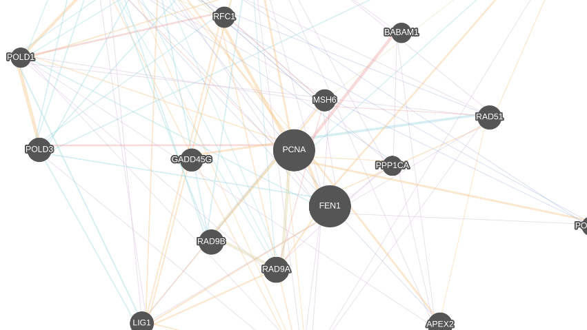

Gene-Gene Graph
===============

Gene-gene graph is a demo graph showing the interactions between various genes.
You can construct this graph in **graphspace_python** by the following steps:

Importing necessary modules
^^^^^^^^^^^^^^^^^^^^^^^^^^^

You have to import the :class:`~graphspace_python.graphs.classes.gsgraph.GSGraph`
class to construct a graph, :class:`~graphspace_python.api.client.GraphSpace` client
class to upload the graph to GraphSpace, and other necessary modules (urllib and json).

>>> import urllib
>>> import json
>>> from graphspace_python.graphs.classes.gsgraph import GSGraph
>>> from graphspace_python.api.client import GraphSpace

Initialize GraphSpace client
^^^^^^^^^^^^^^^^^^^^^^^^^^^^

You have to initialize the GraphSpace client by providing your username and password.

>>> graphspace = GraphSpace('user1@example.com', 'user1')

Fetch graph data
^^^^^^^^^^^^^^^^

You can fetch the structural data of the gene-gene graph, consisting of its nodes
and edges, present in the `Cytoscape.js repository <https://github.com/cytoscape/
cytoscape.js/blob/master/documentation/demos/colajs-graph/data.json>`_, by using
urllib and json module.

>>> data_url = 'https://raw.githubusercontent.com/cytoscape/cytoscape.js/master/documentation/demos/colajs-graph/data.json'
>>> response = urllib.urlopen(data_url)
>>> graph_data = json.loads(response.read())

Fetch style data
^^^^^^^^^^^^^^^^

Similarly, you can fetch the style data of the gene-gene graph, consisting of style
of its nodes and edges, present in the `Cytoscape.js repository <https://github.com/
cytoscape/cytoscape.js/blob/master/documentation/demos/colajs-graph/cy-style.json>`_, by
using urllib and json module.

>>> data_url = 'https://raw.githubusercontent.com/cytoscape/cytoscape.js/master/documentation/demos/colajs-graph/cy-style.json'
>>> response = urllib.urlopen(data_url)
>>> style_data = json.loads(response.read())

Initialize graph
^^^^^^^^^^^^^^^^

You can create a graph using the GSGraph class.

>>> G = GSGraph()

Set name,tags and visibility status
^^^^^^^^^^^^^^^^^^^^^^^^^^^^^^^^^^^

Using the mothods of the GSGraph class you can set name, tags and visibility status
for your newly created graph.

>>> G.set_name('Gene-gene graph')
>>> G.set_tags(['gene-gene', 'graphspace', 'demo'])
>>> G.set_is_public()

Define meta-data
^^^^^^^^^^^^^^^^

Meta data for the graph can be set in the following way:

>>> data = {
>>>     'description': 'This is a demo of a graph of gene-gene interactions. View functional demo of this graph at:\
>>>  <a href=\"http://js.cytoscape.org/demos/colajs-graph/\">http://js.cytoscape.org/demos/colajs-graph/</a>',
>>>     'directed': False
>>> }
>>> G.set_data(data)

Construct nodes and edges of graph from graph data
^^^^^^^^^^^^^^^^^^^^^^^^^^^^^^^^^^^^^^^^^^^^^^^^^^

The fetched graph data is an array of elements where each element is either a node
or edge. To properly construct the graph from the data, add nodes and edges to the
graph by checking whether the element is a node or edge. Morever if the element is
a node, add a popup text (containing the link to the gene type) that is to be shown
when the node is tapped on.

>>> for elem in graph_data:
>>>     if elem['group'] == 'nodes':
>>>         popup = ("<a target=\"_blank\" href=\"http://www.genecards.org/cgi-bin/carddisp.pl?gene=" + elem['data']['name']
>>>                 + "\">GeneCard</a> <a target=\"_blank\" href=\"http://www.uniprot.org/uniprot/?query=" + elem['data']['name']
>>>                 + "&fil=organism%3A%22Homo+sapiens+%28Human%29+%5B9606%5D%22&sort=score\">UniProt search</a> <a target=\"_blank\" href=\"http://genemania.org/search/human/"
>>>                 + elem['data']['name'] + "\">GeneMANIA</a>")
>>>         G.add_node(nodeelem['data']['id'], elem['data'], label=elem['data']['name'], popup=popup)
>>>         G.set_node_position(elem['data']['id'], elem['position']['y'], elem['position']['x'])
>>>     else:
>>>         G.add_edge(elem['data']['source'], elem['data']['target'], elem['data'])

Set styling for graph elements
^^^^^^^^^^^^^^^^^^^^^^^^^^^^^^

Using the fetched style data you can define the the **style_json** for the graph.
As during creating nodes, label is assigned to the nodes from the graph data, there
is no need of the attribute **content** in the style attributes of the nodes. So
styling can be set in the following way:

>>> del(style_data[1]['style']['content'])
>>> style_json = {
>>>     'style': style_data
>>> }
>>> G.set_style_json(style_json)

Upload graph to GraphSpace
^^^^^^^^^^^^^^^^^^^^^^^^^^

Finally, you can upload the graph to GraphSpace.

>>> graph = graphspace.post_graph(G)
>>> graph.url
'http://graphspace.org/graphs/32708'

This demo graph is already present on GraphSpace. You can view it at
`http://graphspace.org/graphs/22710 <http://graphspace.org/graphs/22710>`_

