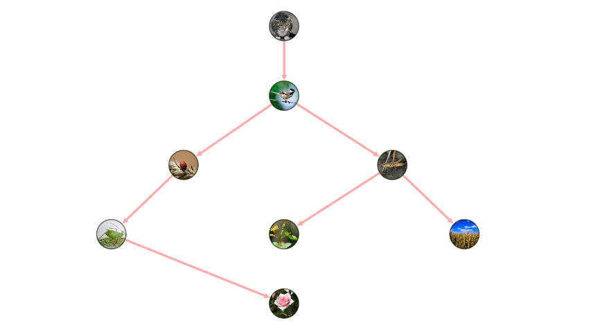

Image Graph
===========

Image graph is a representation of a network whose nodes have images as their background.
You can construct this graph in **graphspace_python** by the following steps:

Importing necessary modules
^^^^^^^^^^^^^^^^^^^^^^^^^^^

You have to import the :class:`~graphspace_python.graphs.classes.gsgraph.GSGraph`
class to construct a graph and :class:`~graphspace_python.api.client.GraphSpace` client
class to upload the graph to GraphSpace.

>>> from graphspace_python.graphs.classes.gsgraph import GSGraph
>>> from graphspace_python.api.client import GraphSpace

Initialize GraphSpace client
^^^^^^^^^^^^^^^^^^^^^^^^^^^^

You have to initialize the GraphSpace client by providing your username and password.

>>> graphspace = GraphSpace('user1@example.com', 'user1')

Initialize graph
^^^^^^^^^^^^^^^^

You can create a graph using the GSGraph class.

>>> G = GSGraph()

Set name,tags and visibility status
^^^^^^^^^^^^^^^^^^^^^^^^^^^^^^^^^^^

Using the mothods of the GSGraph class you can set name, tags and visibility status
for your newly created graph.

>>> G.set_name('Image Graph')
>>> G.set_tags(['image-graph', 'image', 'graphspace', 'demo'])
>>> G.set_is_public()

Define meta-data
^^^^^^^^^^^^^^^^

Meta data for the graph can be set in the following way:

>>> data = {
>>>     'description': 'A demo network where the nodes constitute of images. You can view the functional demo of this graph at:\
>>>  <a href=\"http://js.cytoscape.org/demos/images-breadthfirst-layout/\">http://js.cytoscape.org/demos/images-breadthfirst-layout/</a>',
>>>     'directed': True
>>> }
>>> G.set_data(data)

Adding nodes to the graph
^^^^^^^^^^^^^^^^^^^^^^^^^

You can add nodes to the graph from an iterable container having node names in it.

>>> nodes = ['cat', 'bird', 'ladybug', 'aphid', 'rose', 'grasshopper', 'plant', 'wheat']
>>> G.add_nodes_from(nodes)

Set node positions
^^^^^^^^^^^^^^^^^^

After adding the nodes you can set their positions(x,y coord) in the following way:

>>> G.set_node_position('cat', y=-36.7, x=738.3)
>>> G.set_node_position('bird', y=152.6, x=738.3)
>>> G.set_node_position('ladybug', y=340.1, x=465.2)
>>> G.set_node_position('aphid', y=528.1, x=269)
>>> G.set_node_position('rose', y=716.3, x=738.3)
>>> G.set_node_position('grasshopper', y=340.1, x=1031.8)
>>> G.set_node_position('plant', y=528.1, x=738.3)
>>> G.set_node_position('wheat', y=528.1, x=1227.7)

Adding edges to the graph
^^^^^^^^^^^^^^^^^^^^^^^^^

You can add edges to the graph from an iterable container having source and target pairs in it.

>>> edges = [('cat', 'bird'), ('bird', 'ladybug'), ('bird', 'grasshopper'), ('grasshopper', 'plant'),
>>>         ('grasshopper', 'wheat'), ('ladybug', 'aphid'), ('aphid', 'rose')]
>>> G.add_edges_from(edges)

Set styling for the graph elements
^^^^^^^^^^^^^^^^^^^^^^^^^^^^^^^^^^

You can assign style to the added nodes and edges in the following manner:

>>> G.add_style('node', {
>>>     "height": 80,
>>>     "width": 80,
>>>     "background-fit": "cover",
>>>     "border-color": "#000",
>>>     "border-width": 3,
>>>     "border-opacity": 0.5
>>> })
>>> G.add_style('node[name="bird"]', {
>>>     "background-image": "https://farm8.staticflickr.com/7272/7633179468_3e19e45a0c_b.jpg"
>>> })
>>> G.add_style('node[name="cat"]', {
>>>     "background-image": "https://farm2.staticflickr.com/1261/1413379559_412a540d29_b.jpg"
>>> })
>>> G.add_style('node[name="ladybug"]', {
>>>     "background-image": "https://farm4.staticflickr.com/3063/2751740612_af11fb090b_b.jpg"
>>> })
>>> G.add_style('node[name="aphid"]', {
>>>     "background-image": "https://farm9.staticflickr.com/8316/8003798443_32d01257c8_b.jpg"
>>> })
>>> G.add_style('node[name="rose"]', {
>>>     "background-image": "https://farm6.staticflickr.com/5109/5817854163_eaccd688f5_b.jpg"
>>> })
>>> G.add_style('node[name="grasshopper"]', {
>>>     "background-image": "https://farm7.staticflickr.com/6098/6224655456_f4c3c98589_b.jpg"
>>> })
>>> G.add_style('node[name="plant"]', {
>>>     "background-image": "https://farm1.staticflickr.com/231/524893064_f49a4d1d10_z.jpg"
>>> })
>>> G.add_style('node[name="wheat"]', {
>>>     "background-image": "https://farm3.staticflickr.com/2660/3715569167_7e978e8319_b.jpg"
>>> })
>>> G.add_style('edge', {
>>>     "width": 6,
>>>     "target-arrow-shape": "triangle",
>>>     "line-color": "#ffaaaa",
>>>     "target-arrow-color": "#ffaaaa"
>>> })

Upload graph to GraphSpace
^^^^^^^^^^^^^^^^^^^^^^^^^^

Finally, you can upload the graph to GraphSpace.

>>> graph = graphspace.post_graph(G)
>>> graph.url
'http://graphspace.org/graphs/32708'

This demo graph is already present on GraphSpace. You can view it at
`http://graphspace.org/graphs/22758 <http://graphspace.org/graphs/22758>`_

