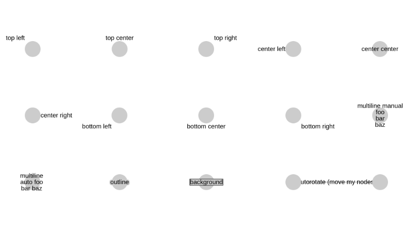

Labels
======

This graph showcases the different styles of labels supported by GraphSpace.
You can construct this graph in **graphspace_python** by the following steps:

Importing necessary modules
^^^^^^^^^^^^^^^^^^^^^^^^^^^

You have to import the :class:`~graphspace_python.graphs.classes.gsgraph.GSGraph`
class to construct a graph, :class:`~graphspace_python.api.client.GraphSpace` client
class to upload the graph to GraphSpace, and other necessary modules (urllib and json).

>>> import urllib
>>> import json
>>> from graphspace_python.graphs.classes.gsgraph import GSGraph
>>> from graphspace_python.api.client import GraphSpace

Initialize GraphSpace client
^^^^^^^^^^^^^^^^^^^^^^^^^^^^

You have to initialize the GraphSpace client by providing your username and password.

>>> graphspace = GraphSpace('user1@example.com', 'user1')

Fetch graph data
^^^^^^^^^^^^^^^^

You can fetch the structural data of the Labels graph, consisting of its nodes
and edges, present in the `graphspace_python repository <https://github.com/adbharadwaj/
graphspace-python/blob/master/demos/labels/graph.json>`_, by using urllib and json module.

>>> data_url = 'https://raw.githubusercontent.com/adbharadwaj/graphspace-python/master/demos/labels/graph.json'
>>> response = urllib.urlopen(data_url)
>>> graph_data = json.loads(response.read())

Fetch style data
^^^^^^^^^^^^^^^^

You can fetch the style data of the Labels graph, consisting of style of its nodes
and edges, present in the `graphspace_python repository <https://github.com/adbharadwaj/
graphspace-python/blob/master/demos/labels/style.json>`_, by using urllib and json module.

>>> data_url = 'https://raw.githubusercontent.com/adbharadwaj/graphspace-python/master/demos/labels/style.json'
>>> response = urllib.urlopen(data_url)
>>> style_data = json.loads(response.read())

Initialize graph
^^^^^^^^^^^^^^^^

You can create a graph using the GSGraph class.

>>> G = GSGraph()

Set name,tags and visibility status
^^^^^^^^^^^^^^^^^^^^^^^^^^^^^^^^^^^

Using the mothods of the GSGraph class you can set name, tags and visibility status
for your newly created graph.

>>> G.set_name('Labels Demo')
>>> G.set_tags(['labels', 'graphspace', 'demo'])
>>> G.set_is_public()

Define meta-data
^^^^^^^^^^^^^^^^

Meta data for the graph can be set in the following way:

>>> data = {
>>>     'description': 'This is a demo graph showing different labels. You can also view this demo graph at:\
>>>  <a href=\"http://js.cytoscape.org/demos/labels/\">http://js.cytoscape.org/demos/labels/</a>',
>>>     'directed': False
>>> }
>>> G.set_data(data)

Set graph structure
^^^^^^^^^^^^^^^^^^^

The fetched graph data is already in the proper json format and ready to be assigned
to the graph. So you can set the structure of the graph in the following way:

>>> G.set_graph_json(graph_data)

Set styling for graph elements
^^^^^^^^^^^^^^^^^^^^^^^^^^^^^^

The fetched style data is already in the proper json format and ready to be assigned
to the graph. So you can set the styling in the following way:

>>> G.set_style_json(style_data)

Upload graph to GraphSpace
^^^^^^^^^^^^^^^^^^^^^^^^^^

Finally, you can upload the graph to GraphSpace.

>>> graph = graphspace.post_graph(G)
>>> graph.url
'http://graphspace.org/graphs/32708'

This demo graph is already present on GraphSpace. You can view it at
`http://graphspace.org/graphs/22774 <http://graphspace.org/graphs/22774>`_

