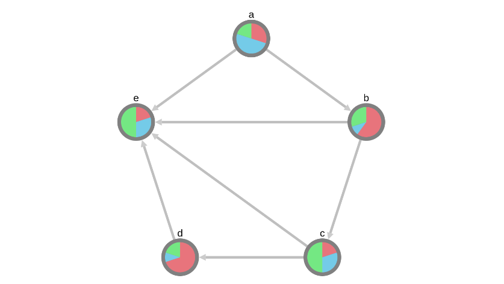

Pie Style
=========

This graph is a demo showing the implementation of pie charts within the nodes.
You can construct this graph in **graphspace_python** by the following steps:

Importing necessary modules
^^^^^^^^^^^^^^^^^^^^^^^^^^^

You have to import the :class:`~graphspace_python.graphs.classes.gsgraph.GSGraph`
class to construct a graph and :class:`~graphspace_python.api.client.GraphSpace` client
class to upload the graph to GraphSpace.

>>> from graphspace_python.graphs.classes.gsgraph import GSGraph
>>> from graphspace_python.api.client import GraphSpace

Initialize GraphSpace client
^^^^^^^^^^^^^^^^^^^^^^^^^^^^

You have to initialize the GraphSpace client by providing your username and password.

>>> graphspace = GraphSpace('user1@example.com', 'user1')

Initialize graph
^^^^^^^^^^^^^^^^

You can create a graph using the GSGraph class.

>>> G = GSGraph()

Set name,tags and visibility status
^^^^^^^^^^^^^^^^^^^^^^^^^^^^^^^^^^^

Using the mothods of the GSGraph class you can set name, tags and visibility status
for your newly created graph.

>>> G.set_name('Pie Style')
>>> G.set_tags(['pie-style', 'pie', 'graphspace', 'demo'])
>>> G.set_is_public()

Define meta-data
^^^^^^^^^^^^^^^^

Meta data for the graph can be set in the following way:

>>> data = {
>>>     'description': 'A demo network where the nodes constitute of pie charts. You can also view this demo graph at:\
>>>  <a href=\"http://js.cytoscape.org/demos/pie-style/\">http://js.cytoscape.org/demos/pie-style/</a>',
>>>     'directed': True
>>> }
>>> G.set_data(data)

Adding nodes to the graph
^^^^^^^^^^^^^^^^^^^^^^^^^

You can add nodes to the graph using the :meth:`~graphspace_python.graphs.classes.gsgraph.GSGraph.add_node`
method available in the GSGraph class.

>>> G.add_node('a', {"foo": 3, "bar": 5, "baz": 2})
>>> G.add_node('b', {"foo": 6, "bar": 1, "baz": 3})
>>> G.add_node('c', {"foo": 2, "bar": 3, "baz": 5})
>>> G.add_node('d', {"foo": 7, "bar": 1, "baz": 2})
>>> G.add_node('e', {"foo": 2, "bar": 3, "baz": 5})

Set node positions
^^^^^^^^^^^^^^^^^^

After adding the nodes you can set their positions(x,y coord) in the following way:

>>> G.set_node_position('a', y=60, x=550.5)
>>> G.set_node_position('b', y=193.2, x=733.8)
>>> G.set_node_position('c', y=408.6, x=663.8)
>>> G.set_node_position('d', y=408.6, x=437.2)
>>> G.set_node_position('e', y=193.2, x=367.2)

Adding edges to the graph
^^^^^^^^^^^^^^^^^^^^^^^^^

You can add edges to the graph using the :meth:`~graphspace_python.graphs.classes.gsgraph.GSGraph.add_edge`
method available in the GSGraph class.

>>> G.add_edge('a', 'e', {'weight': 1})
>>> G.add_edge('a', 'b', {'weight': 3})
>>> G.add_edge('b', 'e', {'weight': 4})
>>> G.add_edge('b', 'c', {'weight': 5})
>>> G.add_edge('c', 'e', {'weight': 6})
>>> G.add_edge('c', 'd', {'weight': 2})
>>> G.add_edge('d', 'e', {'weight': 7})

Set styling for the graph elements
^^^^^^^^^^^^^^^^^^^^^^^^^^^^^^^^^^

You can assign style to the added nodes and edges in the following manner:

>>> G.add_style('node', {
>>>     "width": "60px",
>>>     "height": "60px",
>>>     "content": "data(id)",
>>>     "pie-size": "80%",
>>>     "pie-1-background-color": "#E8747C",
>>>     "pie-1-background-size": "mapData(foo, 0, 10, 0, 100)",
>>>     "pie-2-background-color": "#74CBE8",
>>>     "pie-2-background-size": "mapData(bar, 0, 10, 0, 100)",
>>>     "pie-3-background-color": "#74E883",
>>>     "pie-3-background-size": "mapData(baz, 0, 10, 0, 100)",
>>>     "background-color": "grey",
>>>     "text-valign": "top"
>>> })
>>> G.add_style('edge', {
>>>     "curve-style": "bezier",
>>>     "width": 4,
>>>     "target-arrow-shape": "triangle",
>>>     "opacity": 0.5,
>>>     "line-color": "grey"
>>> })

Upload graph to GraphSpace
^^^^^^^^^^^^^^^^^^^^^^^^^^

Finally, you can upload the graph to GraphSpace.

>>> graph = graphspace.post_graph(G)
>>> graph.url
'http://graphspace.org/graphs/32708'

This demo graph is already present on GraphSpace. You can view it at
`http://graphspace.org/graphs/22755 <http://graphspace.org/graphs/22755>`_

