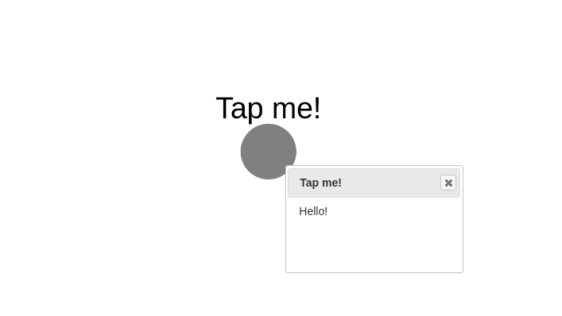

Popup
=====

Popup demo showcases how to use the popup feature of nodes to show description about
the nodes on clicking on them. You can construct this graph in **graphspace_python**
by the following steps:

Importing necessary modules
^^^^^^^^^^^^^^^^^^^^^^^^^^^

You have to import the :class:`~graphspace_python.graphs.classes.gsgraph.GSGraph`
class to construct a graph and :class:`~graphspace_python.api.client.GraphSpace` client
class to upload the graph to GraphSpace.

>>> from graphspace_python.graphs.classes.gsgraph import GSGraph
>>> from graphspace_python.api.client import GraphSpace

Initialize GraphSpace client
^^^^^^^^^^^^^^^^^^^^^^^^^^^^

You have to initialize the GraphSpace client by providing your username and password.

>>> graphspace = GraphSpace('user1@example.com', 'user1')

Initialize graph
^^^^^^^^^^^^^^^^

You can create a graph using the GSGraph class.

>>> G = GSGraph()

Set name,tags and visibility status
^^^^^^^^^^^^^^^^^^^^^^^^^^^^^^^^^^^

Using the mothods of the GSGraph class you can set name, tags and visibility status
for your newly created graph.

>>> G.set_name('Popup Demo')
>>> G.set_tags(['popup', 'graphspace', 'demo'])
>>> G.set_is_public()

Define meta-data
^^^^^^^^^^^^^^^^

Meta data for the graph can be set in the following way:

>>> data = {
>>>     'description': 'This is a demo graph showing functionality of popup in GraphSpace.'
>>> }
>>> G.set_data(data)

Adding a node to the graph
^^^^^^^^^^^^^^^^^^^^^^^^^^

You can add a node having an attribute **popup**, which can be any HTML formatted
text you want to show when the node is clicked on.

>>> G.add_node('n', label='Tap me!', popup='Hello!')

Set styling for the node
^^^^^^^^^^^^^^^^^^^^^^^^

You can assign style to the added node in the following manner:

>>> G.add_style('node', {
>>>     "content": "data(label)",
>>>     "background-color": "grey",
>>>     "text-valign": "top"
>>> })

Upload graph to GraphSpace
^^^^^^^^^^^^^^^^^^^^^^^^^^

Finally, you can upload the graph to GraphSpace.

>>> graph = graphspace.post_graph(G)
>>> graph.url
'http://graphspace.org/graphs/32708'

This demo graph is already present on GraphSpace. You can view it at
`http://graphspace.org/graphs/22708 <http://graphspace.org/graphs/22708>`_

