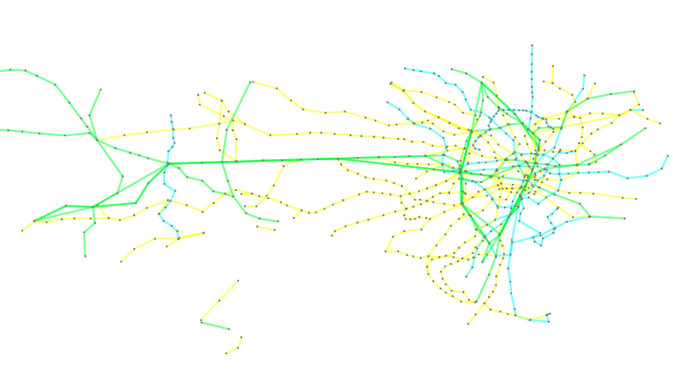

Tokyo Railways
==============

Tokyo Railways graph is a representation of the railway network of Tokyo.
You can construct this graph in **graphspace_python** by the following steps:

Importing necessary modules
^^^^^^^^^^^^^^^^^^^^^^^^^^^

You have to import the :class:`~graphspace_python.graphs.classes.gsgraph.GSGraph`
class to construct a graph, :class:`~graphspace_python.api.client.GraphSpace` client
class to upload the graph to GraphSpace, and other necessary modules (urllib and json).

>>> import urllib
>>> import json
>>> from graphspace_python.graphs.classes.gsgraph import GSGraph
>>> from graphspace_python.api.client import GraphSpace

Initialize GraphSpace client
^^^^^^^^^^^^^^^^^^^^^^^^^^^^

You have to initialize the GraphSpace client by providing your username and password.

>>> graphspace = GraphSpace('user1@example.com', 'user1')

Fetch graph data
^^^^^^^^^^^^^^^^

You can fetch the structural data of the Tokyo Railways graph, consisting of its nodes
and edges, present at `https://cdn.rawgit.com/maxkfranz/934042c1ecc464a8de85/raw
<https://cdn.rawgit.com/maxkfranz/934042c1ecc464a8de85/raw>`_, by using
urllib and json module.

>>> data_url = 'https://cdn.rawgit.com/maxkfranz/934042c1ecc464a8de85/raw'
>>> response = urllib.urlopen(data_url)
>>> graph_data = json.loads(response.read())

Initialize graph
^^^^^^^^^^^^^^^^

You can create a graph using the GSGraph class.

>>> G = GSGraph()

Set name,tags and visibility status
^^^^^^^^^^^^^^^^^^^^^^^^^^^^^^^^^^^

Using the mothods of the GSGraph class you can set name, tags and visibility status
for your newly created graph.

>>> G.set_name('Tokyo Railways')
>>> G.set_tags(['tokyo-railways', 'graphspace', 'demo'])
>>> G.set_is_public()

Define meta-data
^^^^^^^^^^^^^^^^

Meta data for the graph can be set in the following way:

>>> data = {
>>>     'description': 'Graphical representation of railway network of Tokyo. View functional demo of this graph at:\
>>>  <a href=\"http://js.cytoscape.org/demos/tokyo-railways/\">http://js.cytoscape.org/demos/tokyo-railways/</a>',
>>>     'directed': False
>>> }
>>> G.set_data(data)

Construct nodes and edges of graph from graph data
^^^^^^^^^^^^^^^^^^^^^^^^^^^^^^^^^^^^^^^^^^^^^^^^^^

The fetched graph data is a dictionary having an array of nodes and an array of edges
in it. You can iterate through the arrays to add nodes, node positions and edges
in the following manner:

>>> for node in graph_data['elements']['nodes']:
>>>     G.add_node(node['data']['id'], node['data'])
>>>     G.set_node_position(node['data']['id'], node['position']['y'], node['position']['x'])
>>> for edge in graph_data['elements']['edges']:
>>>     G.add_edge(edge['data']['source'], edge['data']['target'], edge['data'])

Set styling for graph elements
^^^^^^^^^^^^^^^^^^^^^^^^^^^^^^

You can define style for the nodes and edges of the graph in the following manner:

>>> G.add_style('node', {
>>>     "font-size": 16,
>>>     "color": "orange",
>>>     "min-zoomed-font-size": 12,
>>>     "content": "data(station_name)",
>>>     "width": 20,
>>>     "z-index": 1,
>>>     "border-color": "black",
>>>     "height": 20,
>>>     "background-color": "grey"
>>> })
>>> G.add_style('edge', {
>>>     "opacity": 0.5,
>>>     "font-size": 8,
>>>     "color": "grey",
>>>     "line-color": "green",
>>>     "min-zoomed-font-size": 12,
>>>     "content": "data(line_name)",
>>>     "width": 20,
>>>     "curve-style": "haystack",
>>>     "haystack-radius": 0
>>> })
>>> G.add_style('edge[company_type = 0]', {
>>>     "line-color": "#00FFFF"
>>> })
>>> G.add_style('edge[company_type = 1]', {
>>>     "line-color": "#00FF33"
>>> })
>>> G.add_style('edge[company_type = 2]', {
>>>     "line-color": "yellow"
>>> })

Upload graph to GraphSpace
^^^^^^^^^^^^^^^^^^^^^^^^^^

Finally, you can upload the graph to GraphSpace.

>>> graph = graphspace.post_graph(G)
>>> graph.url
'http://graphspace.org/graphs/32708'

This demo graph is already present on GraphSpace. You can view it at
`http://graphspace.org/graphs/22683 <http://graphspace.org/graphs/22683>`_

