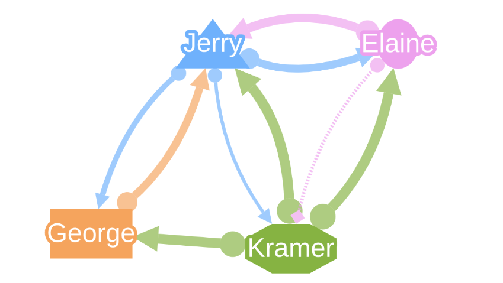

Visual Style
============

This graph is a demo showing different visually appealing features applicable to
nodes and edges in GraphSpace. You can construct this graph in **graphspace_python**
by the following steps:

Importing necessary modules
^^^^^^^^^^^^^^^^^^^^^^^^^^^

You have to import the :class:`~graphspace_python.graphs.classes.gsgraph.GSGraph`
class to construct a graph and :class:`~graphspace_python.api.client.GraphSpace` client
class to upload the graph to GraphSpace.

>>> from graphspace_python.graphs.classes.gsgraph import GSGraph
>>> from graphspace_python.api.client import GraphSpace

Initialize GraphSpace client
^^^^^^^^^^^^^^^^^^^^^^^^^^^^

You have to initialize the GraphSpace client by providing your username and password.

>>> graphspace = GraphSpace('user1@example.com', 'user1')

Initialize graph
^^^^^^^^^^^^^^^^

You can create a graph using the GSGraph class.

>>> G = GSGraph()

Set name,tags and visibility status
^^^^^^^^^^^^^^^^^^^^^^^^^^^^^^^^^^^

Using the mothods of the GSGraph class you can set name, tags and visibility status
for your newly created graph.

>>> G.set_name('Visual Style')
>>> G.set_tags(['visual', 'graphspace', 'demo'])
>>> G.set_is_public()

Define meta-data
^^^^^^^^^^^^^^^^

Meta data for the graph can be set in the following way:

>>> data = {
>>>     'description': 'A demo visual network. You can also view this demo graph at:\
>>>  <a href=\"http://js.cytoscape.org/demos/visual-style/\">http://js.cytoscape.org/demos/visual-style/</a>',
>>>     'directed': True
>>> }
>>> G.set_data(data)

Adding nodes to the graph
^^^^^^^^^^^^^^^^^^^^^^^^^

You can add nodes to the graph using the :meth:`~graphspace_python.graphs.classes.gsgraph.GSGraph.add_node`
method available in the GSGraph class.

>>> G.add_node('j', {"weight": 65, "faveColor": "#6FB1FC"}, label='Jerry')
>>> G.add_node('e', {"weight": 45, "faveColor": "#EDA1ED"}, label='Elaine')
>>> G.add_node('k', {"weight": 75, "faveColor": "#86B342"}, label='Kramer')
>>> G.add_node('g', {"weight": 70, "faveColor": "#F5A45D"}, label='George')

Set node positions
^^^^^^^^^^^^^^^^^^

After adding the nodes you can set their positions(x,y coord) in the following way:

>>> G.set_node_position('j', y=482.1, x=529.9)
>>> G.set_node_position('e', y=482.4, x=641.8)
>>> G.set_node_position('k', y=606.4, x=577.3)
>>> G.set_node_position('g', y=597.5, x=456.4)

Adding edges to the graph
^^^^^^^^^^^^^^^^^^^^^^^^^

You can add edges to the graph using the :meth:`~graphspace_python.graphs.classes.gsgraph.GSGraph.add_edge`
method available in the GSGraph class.

>>> G.add_edge('j', 'e', {"faveColor": "#6FB1FC", "strength": 90})
>>> G.add_edge('j', 'k', {"faveColor": "#6FB1FC", "strength": 70})
>>> G.add_edge('j', 'g', {"faveColor": "#6FB1FC", "strength": 80})
>>> G.add_edge('e', 'j', {"faveColor": "#EDA1ED", "strength": 95})
>>> G.add_edge('e', 'k', {"faveColor": "#EDA1ED", "strength": 60, "type": "questionable"})
>>> G.add_edge('k', 'j', {"faveColor": "#86B342", "strength": 100})
>>> G.add_edge('k', 'e', {"faveColor": "#86B342", "strength": 100})
>>> G.add_edge('k', 'g', {"faveColor": "#86B342", "strength": 100})
>>> G.add_edge('g', 'j', {"faveColor": "#F5A45D", "strength": 90})

Set styling for the graph elements
^^^^^^^^^^^^^^^^^^^^^^^^^^^^^^^^^^

You can assign style to the added nodes and edges in the following manner:

>>> G.add_style('node', {
>>>     "width": "mapData(weight, 40, 80, 20, 60)",
>>>     "content": "data(label)",
>>>     "text-valign": "center",
>>>     "text-outline-width": 2,
>>>     "text-outline-color": "data(faveColor)",
>>>     "background-color": "data(faveColor)",
>>>     "color": "#fff"
>>> })
>>> G.add_style('node[name="j"]', {
>>>     "shape": "triangle"
>>> })
>>> G.add_style('node[name="e"]', {
>>>     "shape": "ellipse"
>>> })
>>> G.add_style('node[name="k"]', {
>>>     "shape": "octagon"
>>> })
>>> G.add_style('node[name="g"]', {
>>>     "shape": "rectangle"
>>> })
>>> G.add_style('edge', {
>>>     "curve-style": "bezier",
>>>     "opacity": 0.666,
>>>     "width": "mapData(strength, 70, 100, 2, 6)",
>>>     "target-arrow-shape": "triangle",
>>>     "source-arrow-shape": "circle",
>>>     "line-color": "data(faveColor)",
>>>     "source-arrow-color": "data(faveColor)",
>>>     "target-arrow-color": "data(faveColor)"
>>> })
>>> G.add_style('edge[type = "questionable"]', {
>>>     "line-style": "dotted",
>>>     "target-arrow-shape": "diamond"
>>> })

Upload graph to GraphSpace
^^^^^^^^^^^^^^^^^^^^^^^^^^

Finally, you can upload the graph to GraphSpace.

>>> graph = graphspace.post_graph(G)
>>> graph.url
'http://graphspace.org/graphs/32708'

This demo graph is already present on GraphSpace. You can view it at
`http://graphspace.org/graphs/22789 <http://graphspace.org/graphs/22789>`_

