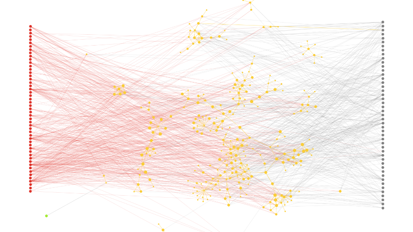

Wine & Cheese
=============

Wine & Cheese map is a network showing the pairing of different kinds of wine and cheese.
You can construct this graph in **graphspace_python** by the following steps:

Importing necessary modules
^^^^^^^^^^^^^^^^^^^^^^^^^^^

You have to import the :class:`~graphspace_python.graphs.classes.gsgraph.GSGraph`
class to construct a graph, :class:`~graphspace_python.api.client.GraphSpace` client
class to upload the graph to GraphSpace, and other necessary modules (urllib and json).

>>> import urllib
>>> import json
>>> from graphspace_python.graphs.classes.gsgraph import GSGraph
>>> from graphspace_python.api.client import GraphSpace

Initialize GraphSpace client
^^^^^^^^^^^^^^^^^^^^^^^^^^^^

You have to initialize the GraphSpace client by providing your username and password.

>>> graphspace = GraphSpace('user1@example.com', 'user1')

Fetch graph data
^^^^^^^^^^^^^^^^

You can fetch the structural data of the Wine and Cheese map, consisting of its nodes
and edges, present in the `Cytoscape repository <https://github.com/cytoscape/
wineandcheesemap/blob/gh-pages/data.json>`_, by using urllib and json module.

>>> data_url = 'https://raw.githubusercontent.com/cytoscape/wineandcheesemap/gh-pages/data.json'
>>> response = urllib.urlopen(data_url)
>>> graph_data = json.loads(response.read())

Fetch style data
^^^^^^^^^^^^^^^^

You can fetch the style data of the Wine and Cheese map, consisting of style of its nodes
and edges, present in the `graphspace_python repository <https://github.com/adbharadwaj/
graphspace-python/blob/master/demos/wineandcheesemap/style.json>`_, by using
urllib and json module.

>>> data_url = 'https://raw.githubusercontent.com/adbharadwaj/graphspace-python/master/demos/wineandcheesemap/style.json'
>>> response = urllib.urlopen(data_url)
>>> style_data = json.loads(response.read())

Initialize graph
^^^^^^^^^^^^^^^^

You can create a graph using the GSGraph class.

>>> G = GSGraph()

Set name,tags and visibility status
^^^^^^^^^^^^^^^^^^^^^^^^^^^^^^^^^^^

Using the mothods of the GSGraph class you can set name, tags and visibility status
for your newly created graph.

>>> G.set_name('Wine and Cheese')
>>> G.set_tags(['wineandcheese', 'graphspace', 'demo'])
>>> G.set_is_public()

Define meta-data
^^^^^^^^^^^^^^^^

Meta data for the graph can be set in the following way:

>>> data = {
>>>     'description': 'Network of wine and cheese pairing. View functional demo of this graph at:\
>>>  <a href=\"http://www.wineandcheesemap.com/\">http://www.wineandcheesemap.com/</a>',
>>>     'directed': False
>>> }
>>> G.set_data(data)

Construct nodes and edges of graph from graph data
^^^^^^^^^^^^^^^^^^^^^^^^^^^^^^^^^^^^^^^^^^^^^^^^^^

The fetched graph data is a dictionary having an array of nodes and an array of edges
in it. You can iterate through the arrays to add nodes, node positions and edges
in the following manner:

>>> for node in graph_data['elements']['nodes']:
>>>     G.add_node(node['data']['id'], node['data'], label=node['data']['name'])
>>>     G.set_node_position(node['data']['id'], node['position']['y'], node['position']['x'])
>>> for edge in graph_data['elements']['edges']:
>>>     G.add_edge(edge['data']['source'], edge['data']['target'], edge['data'])

Set styling for graph elements
^^^^^^^^^^^^^^^^^^^^^^^^^^^^^^

The fetched style data is already in the proper json format and ready to be assigned
to the graph. So you can set the styling in the following way:

>>> G.set_style_json(style_data)

Upload graph to GraphSpace
^^^^^^^^^^^^^^^^^^^^^^^^^^

Finally, you can upload the graph to GraphSpace.

>>> graph = graphspace.post_graph(G)
>>> graph.url
'http://graphspace.org/graphs/32708'

This demo graph is already present on GraphSpace. You can view it at
`http://graphspace.org/graphs/22692 <http://graphspace.org/graphs/22692>`_

