Start here to begin working with `graphspace-python`.

Connecting to GraphSpace
------------------------
You can connect to GraphSpace using your username and password. You can also set the api host using the **set_api_host** method if you are using a different server.

>>> from graphspace_python.api.client import GraphSpace
>>> graphspace = GraphSpace('user1@example.com', 'user1')
>>> # graphspace.set_api_host('localhost:8000')

Creating a graph
----------------

Create an empty graph with no nodes and no edges.

>>> from graphspace_python.graphs.classes.gsgraph import GSGraph
>>> G = GSGraph()

Nodes
-----

You can add one node at a time.

>>> # Adding a node 'a' with a given popup and label
>>> G.add_node('a', popup='sample node popup text', label='A')
>>> # Adding style information for node 'a'
>>> G.add_node_style('a', shape='ellipse', color='red', width=90, height=90)

>>> # Adding a node 'b' with a given popup and label
>>> G.add_node('b', popup='sample node popup text', label='B')
>>> # Adding style information for node 'b'
>>> G.add_node_style('b', shape='ellipse', color='blue', width=40, height=40)

Edges
-----

You can also add one edge at a time using the **add_edge** method.

>>> G.add_edge('a', 'b', directed=True, popup='sample edge popup')
>>> G.add_edge_style('a', 'b', directed=True, edge_style='dotted')

Graph Information
-----------------
You can add more meaningful information about the graph like name, description and tags.

>>> G.set_name('My Sample Graph')
>>> G.set_data(data={
...     'description': 'my sample graph'
... })
>>> G.set_tags(['sample'])

Saving a graph on GraphSpace
----------------------------
You can save your graph online using the **post_graph** method.

>>> graphspace.post_graph(G)

The saved graph will look like this on GraphSpace:

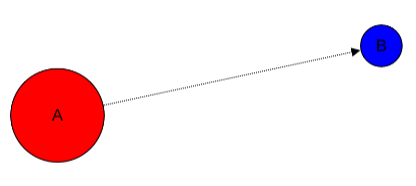

Fetching a graph from GraphSpace
--------------------------------

You can retrieve your saved graph anytime from GraphSpace using the **get_graph** method.

>>> graph = graphspace.get_graph(name='My Sample Graph')
>>> # You can retrieve a graph by id as well - graphspace.get_graph(graph_id=29824)

Updating a graph on GraphSpace
------------------------------
You can also update your graph anytime using the **update_graph** method.

>>> G = GSGraph()
>>> G.add_node('a', popup='sample node popup text', label='A updated')
>>> G.add_node_style('a', shape='ellipse', color='green', width=90, height=90)
>>> G.add_node('b', popup='sample node popup text', label='B updated')
>>> G.add_node_style('b', shape='ellipse', color='yellow', width=40, height=40)
>>> G.add_edge('a', 'b', directed=True, popup='sample edge popup')
>>> G.add_edge_style('a', 'b', directed=True, edge_style='dotted')
>>> G.set_name('My Sample Graph')
>>> G.set_data(data={
...    'description': 'my sample graph'
... })
>>> G.set_is_public(1)
>>> graphspace.update_graph(graph=G, name='My Sample Graph')
>>> # You can update a graph by id as well - graphspace.update_graph(graph=G, graph_id=29824)

The updated graph will look like this on GraphSpace:

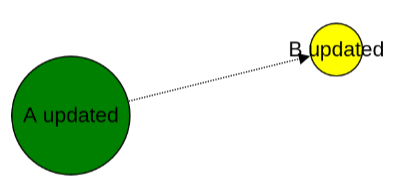

Here is another example.

>>> # Retrieving graph
>>> graph = graphspace.get_graph(name='My Sample Graph')
>>> # Modifying the retrieved graph object
>>> graph.add_node('z', popup='sample node popup text', label='Z')
>>> graph.add_node_style('z', shape='ellipse', color='green', width=90, height=90)
>>> graph.add_edge('a', 'z', directed=True, popup='sample edge popup')
>>> graph.add_edge_style('a', 'z', directed=True, edge_style='dotted')
>>> graph.set_is_public(1)
>>> # Updating graph
>>> graphspace.update_graph(graph=graph, name='My Sample Graph')

The updated graph in this case will look like this on GraphSpace:

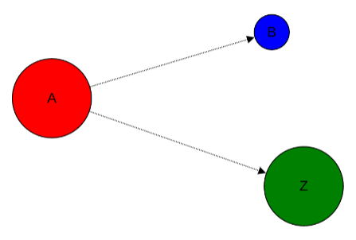

Making a graph public on GraphSpace
-----------------------------------

You can also make a graph public using the **make_graph_public** method.

>>> graphspace.make_graph_public(name='My Sample Graph')
>>> assert graphspace.get_graph(name='My Sample Graph').is_public == 1

Making a graph private on GraphSpace
------------------------------------

You can also make a graph private using the **make_graph_private** method.

>>> graphspace.make_graph_private(name='My Sample Graph')
>>> assert graphspace.get_graph(name='My Sample Graph').is_public == 0

Deleting a graph on GraphSpace
------------------------------

You can also delete your graph anytime using the **delete_graph** method.

>>> print graphspace.delete_graph(name='My Sample Graph')
>>> # You can delete a graph by id as well - graphspace.delete_graph(graph_id=29824)
Successfully deleted graph with id=29824
>>> assert graphspace.get_graph(name='My Sample Graph') is None

Creating a layout
-----------------

Create an empty layout with no node positions and style properties.

>>> from graphspace_python.graphs.classes.gslayout import GSLayout
>>> L = GSLayout()

Node Positions
--------------

You can set position of one node at a time.

>>> # Setting position of a node 'a' with y and x coordinates
>>> L.set_node_position('a', y=38.5, x=67.3)

>>> # Setting position of a node 'b' with y and x coordinates
>>> L.set_node_position('b', y=124, x=332.2)

Note: Setting position of an already present node updates its position.

Style
-----

You can also add style for a node or an edge.

>>> L.add_node_style('a', shape='ellipse', color='green', width=60, height=60)
>>> L.add_edge_style('a', 'b', directed=True, edge_style='dashed')

Layout Information
------------------
You can add more meaningful information about the layout like name, sharing status.

>>> L.set_name('My Sample Layout')
>>> L.set_is_shared(1)

Saving a layout on GraphSpace
-----------------------------
You can save your layout online using the **post_graph_layout** method.

>>> graphspace.post_graph_layout(graph_id=21722, layout=L)

The saved layout will look like this on GraphSpace:

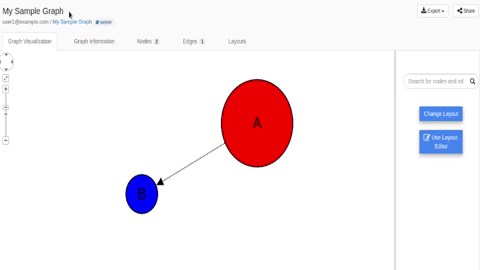

Fetching a layout from GraphSpace
---------------------------------

You can retrieve your saved layout anytime from GraphSpace using the **get_graph_layout** method.

>>> layout = graphspace.get_graph_layout(graph_id=21722, name='My Sample Layout')
>>> # You can retrieve a layout by id as well - graphspace.get_graph_layout(graph_id=21722, layout_id=1068)

Updating a layout on GraphSpace
-------------------------------
You can also update your layout anytime using the **update_graph_layout** method.

>>> L = GSLayout()
>>> L.set_node_position('b', y=38.5, x=67.3)
>>> L.set_node_position('a', y=102, x=238.1)
>>> L.add_node_style('a', shape='octagon', color='green', width=60, height=60)
>>> L.add_edge_style('a', 'b', directed=True, edge_style='solid')
>>> L.set_name('My Sample Layout')
>>> L.set_is_shared(1)
>>> graphspace.update_graph_layout(graph_id=21722, name='My Sample Layout', layout=L)
>>> # You can update a layout by id as well - graphspace.update_graph_layout(graph_id=21722, layout_id=1068, layout=L)

The updated layout will look like this on GraphSpace:

.. image:: images/update_layout1.gif

Here is another example.

>>> # Retrieving layout
>>> layout = graphspace.get_graph_layout(graph_id=21722, name='My Sample Layout')
>>> # Modifying the retrieved layout object
>>> layout.set_node_position('b', y=30, x=67)
>>> layout.set_node_position('a', y=30, x=211)
>>> layout.add_node_style('a', shape='roundrectangle', color='green', width=45, height=45)
>>> layout.add_edge_style('a', 'b', directed=True, edge_style='solid')
>>> layout.set_is_shared(0)
>>> # Updating layout
>>> graphspace.update_graph_layout(graph_id=21722, name='My Sample Layout', layout=layout)

The updated layout in this case will look like this on GraphSpace:

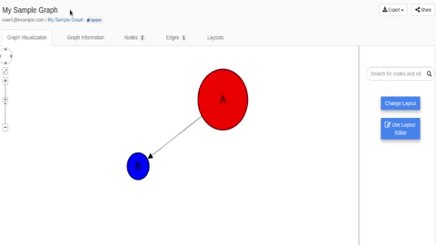

Deleting a layout on GraphSpace
-------------------------------

You can also delete your layout anytime using the **delete_graph_layout** method.

>>> print graphspace.delete_graph_layout(graph_id=21722, name='My Sample Layout')
>>> # You can delete a layout by id as well - graphspace.delete_graph_layout(graph_id=21722, layout_id=1068)
Successfully deleted layout with id=1068

Creating a group
----------------

You can a create a group using the **GSGroup** class.

>>> from graphspace_python.graphs.classes.gsgroup import GSGroup
>>> group = GSGroup(name='My first group', description='sample group')

You can also set name and description of the group using the **set_name** and **set_description** methods.

>>> group = GSGroup()
>>> group.set_name('My first group')
>>> group.set_description('sample group')

Saving a group on GraphSpace
----------------------------
You can save your group online using the **post_group** method.

>>> graphspace.post_group(group)

You can also view your saved group on GraphSpace.

Fetching a group from GraphSpace
--------------------------------

You can retrieve your saved group anytime from GraphSpace using the **get_group** method.

>>> group = graphspace.get_group(name='My first group')
>>> # You can retrieve a group by id as well - graphspace.get_group(group_id=318)

Updating a group on GraphSpace
------------------------------
You can also update your group anytime using the **update_group** method.

>>> group = GSGroup(name='My first group', description='updated description')
>>> graphspace.update_group(group, name='My first group')
>>> # You can update a group by id as well - graphspace.update_group(group, group_id=318)

Here is another example.

>>> group = graphspace.get_group(name='My first group')
>>> group.set_description('updated description')
>>> graphspace.update_group(group, name='My first group')

You can also view your updated group on GraphSpace.

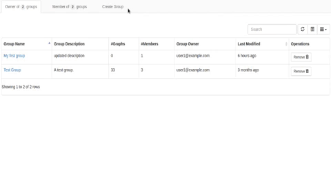

Fetching members of a group from GraphSpace
-------------------------------------------
You can retrieve the members of your group anytime using the **get_group_members** method.

>>> members = graphspace.get_group_members(name='My first group')
>>> # You can retrieve group members by group_id as well - graphspace.get_group_members(group_id=318)

Adding a member to a group on GraphSpace
----------------------------------------
You can add a member to your group anytime using the **add_group_member** method.

>>> response = graphspace.add_group_member(member_email='user3@example.com', name='My first group')
>>> # You can add a group member by group_id as well - graphspace.add_group_member(member_email='user3@example.com', group_id=318)
>>> member_id = response['user_id']

You can also view the added member on GraphSpace.

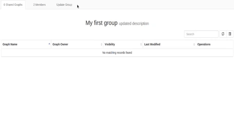

Deleting a member from a group on GraphSpace
--------------------------------------------
You can delete a member from your group anytime using the **delete_group_member** method.

>>> print graphspace.delete_group_member(member_id=47, name='My first group')
>>> # You can delete a group member by group_id as well - graphspace.delete_group_member(member_id=47, group_id=318)
Successfully deleted member with id=47 from group with id=318

You can also view the change on GraphSpace.

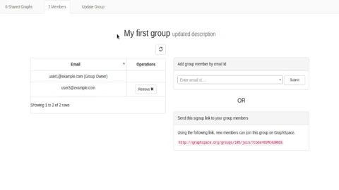

Fetching graphs of a group from GraphSpace
------------------------------------------
You can retrieve the graphs of your group anytime using the **get_group_graphs** method.

>>> graphs = graphspace.get_group_graphs(name='My first group')
>>> # You can retrieve group graphs by group_id as well - graphspace.get_group_graphs(group_id=318)

Adding a graph to a group on GraphSpace
----------------------------------------
You can add a graph to your group anytime using the **add_group_graph** method.

>>> graphspace.add_group_graph(graph_id=34786, name='My first group')
>>> # You can add a group graph by group_id as well - graphspace.add_group_graph(graph_id=34786, group_id=318)

You can also view the added graph on GraphSpace.

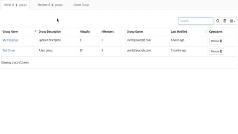

Deleting a graph from a group on GraphSpace
-------------------------------------------
You can delete a graph from your group anytime using the **delete_group_graph** method.

>>> print graphspace.delete_group_graph(graph_id=34786, name='My first group')
>>> # You can delete a group graph by group_id as well - graphspace.delete_group_graph(graph_id=34786, group_id=318)
Successfully deleted graph with id=34786 from group with id=318

You can also view the change on GraphSpace.

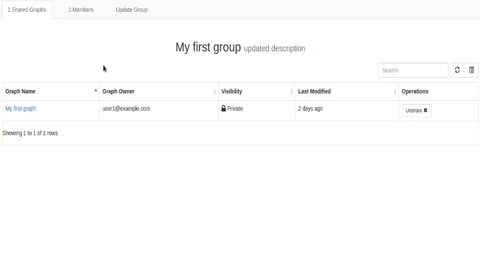

Deleting a group on GraphSpace
------------------------------

You can also delete your group anytime using the **delete_group** method.

>>> print graphspace.delete_group(name='My first group')
>>> # You can delete a group by id as well - graphspace.delete_group(group_id=318)
Successfully deleted group with id=318

You can also view the change on GraphSpace.

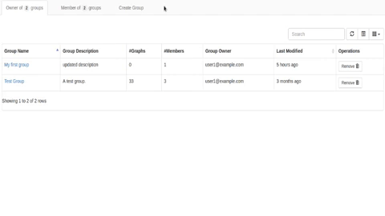

Responses
---------

Responses from the API are parsed into the respective object types.

Graphs endpoint responses
-------------------------

When response has a single **Graph** object:

>>> graph = graphspace.get_graph('My Sample Graph')
>>> graph.name
u'My Sample Graph'

When response has multiple **Graph** objects:

>>> graphs = graphspace.get_my_graphs()
>>> graphs
[<Graph 1>, <Graph 2>, ...]
>>> graphs[0].name
u'My Sample Graph'

Layouts endpoint responses
--------------------------

When response has a single **Layout** object:

>>> layout = graphspace.get_graph_layout(graph_id=21722, name='My Sample Layout')
>>> layout.name
u'My Sample Layout'

When response has multiple **Layout** objects:

>>> layouts = graphspace.get_my_graph_layouts(graph_id=21722)
>>> layouts
[<Layout 1>, <Layout 2>, ...]
>>> layouts[0].name
u'My Sample Layout'

Groups endpoint responses
-------------------------

When response has a single **Group** object:

>>> group = graphspace.get_group(name='My first group')
>>> group.name
u'My first group'

When response has multiple **Group** objects:

>>> groups = graphspace.get_my_groups()
>>> groups
[<Group 1>, <Group 2>, ...]
>>> groups[0].name
u'My first group'

Groups member response
----------------------

Group member response consists of an array of **Member** objects.

>>> members = graphspace.get_group_members(name='My first group')
>>> members
[<Member 1>, <Member 2>, ...]
>>> members[0].email
u'user1@example.com'
